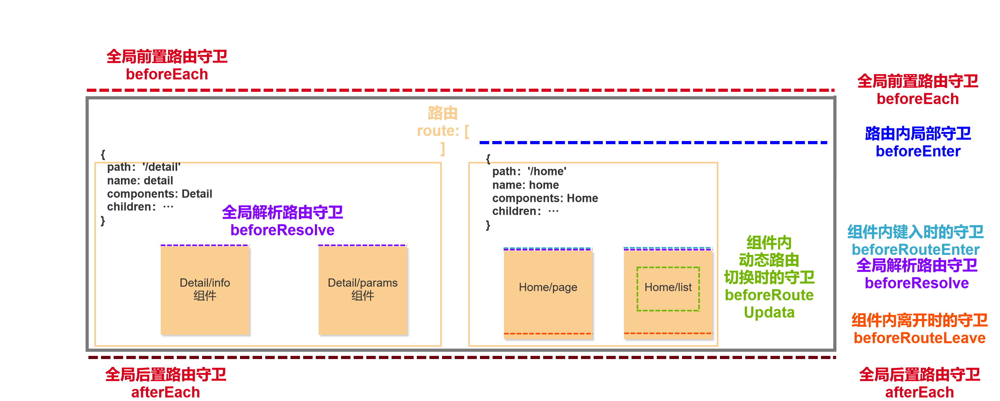

## vue-router

> **Vue 的路由**
>
> **Vue 内的路由指的是前端路由**
>
> ​	**=> 根据不同的 "指示" 在 同一个位置 显示不同的页面结构**
>
> ​	**=> "指示": 一般地址栏信息, 目前使用 hash(哈希/锚点)**
>
> + **因为 框架的路由 机制**
>      + **因为框架最擅长的开发叫做 单页面应用程序(SPA)**
>      + **Single Page Application****
> + **主要技术**
>   + **组件**
>   +  **vue-router   Vue 的核心插件之一, 路由**


**开始使用**

```js
// 该文件专门用于创建整个应用的路由器
import vue from 'vue'
import VueRouter from 'vue-router'

// 引入组件
import First from '../views/first'
import Second from '../views/second'
import Third from '../views/third'
import Fourth from '../views/fourth'

// 挂载 使用插件
vue.use(VueRouter)

// 配置路由表
const routes = [
  // 在 routes 配置项里面进行所有你需要的路由配置
  { // 路由重定向
    path: '/', // 打开页面的时候, 就是一个 /
    // 自动切换到哪一个路由
    redirect: '/first'
  },
  { // 配置第一个路由
    path: '/first',
    // 选填, 你自己写一个路由名称
    name: 'first',
    // 该指令出现的时候, 使用哪一个组件去填写 router-view 标签的位置
    component: First
  },
  { // 配置第二个路由
    path: '/second',
    component: Second
  },
  { // 配置第三个路由
    path: '/third',
    component: Third
  },
  { // 配置第四个路由
    path: '/fourth',
    component: Fourth
  }
]

// 创建一个路由器
const router = new VueRouter({
  // 配置项, 配置该实例需要使用的路由表
  routes
})

// 将准备好的路由器暴露出去
export default router
```


```js
import Vue from 'vue'
import App from './App.vue'

// 引入 router 路由器
import router from './router'

Vue.config.productionTip = false

new Vue({
  render: h => h(App),
  // 配置项, 配置该实例需要使用的路由器
  router
}).$mount('#app')
```


```vue
<template>
  <div>
    {{message}}
    <hr>

    <!--
      <a href="#/first">显示一号组件</a> <br> <a href="#/second">显示二号组件</a>
      vue-router 不推荐使用 a 标签
        + 因为他给你提供了一个 路由跳转 标签
        + 叫做 router-link
          => to属性: 就是你要跳转的路径地址.
          => tag属性: 就是要以什么标签显示 默认是 a标签
    -->

    <ul>
      <router-link to="/first" tag="li">一号组件</router-link>
      <router-link to="/second" tag="li">二号组件</router-link>
      <router-link to="/third" tag="li">三号组件</router-link>
      <router-link to="/fourth" tag="li">四号组件</router-link>
    </ul>

    <!-- 当你将来切换路由的时候, 会把应该显示的内容去替换这个 router-view 标签位置 (挖坑)-->
    <div class="box">
      <router-view></router-view>
    </div>
  </div>
</template>

<script>
export default {
  name: 'App',
  data () {
    return {
      message: 'hello Vue Router'
    }
  }
}
</script>

<style>
  body, ul, hr{
    margin: 0;
    padding: 0;
    list-style: none;
  }

  ul {
    width: 100%;
    height: 50px;
    display: flex;
    justify-content: center;
    align-items: center;
  }

  li {
    height: 100%;
    flex: 1;
    text-align: center;
    line-height: 50px;
    background-color: orange;
    cursor: pointer;
  }

  .box {
    text-align: center;
    font-size: 30px;
  }

  .router-link-active {
    background-color: yellow;
  }
</style>
```


### 路由嵌套

> **嵌套路由，表示在某一个路由视图内，进行第二层的路由嵌套**
>
>   **分析： "指示"**
>
> + /home 的时候，使用 Home 组件占所有位置
> + /list 的时候， 使用 List 组件占所有位置
>     + /list/xxx  的时候， 使用 Page 组件占 List 组件内的一部分位置
>     + 在需要渲染的路由基础上 进行继续增加二级路由、
>
> 
>
>   **分析: "视图"**
> + 因为之前的 一级路由都是占据所有位置
> + 直接书写在指定位置即可
>      + 如果依旧还是使用之前一个路由视图标签 
>      + 渲染出来的内容就是在所有位置, 而不是 list 的一部分位置
>      + 应该把二级视图标签书写在 list 内部的某一个位置
>
> 
>
>   **书写:** 
> + 在本身的一级路由配置项内进行一个 **children** 的配置项
> + **语法: children: [ {每一个子路由} ]**

```js
// 配置路由表
const routes = [
  {
    path: '/',
    redirect: '/home'
  },
  {
    path: '/home',
    name: 'home',
    component: Home
  },
  {
    path: '/list',
    component: List,
    children: [		// 配置子级路由
      {
        path: 'page',
        component: Page
      }
    ]
  },
  {
    path: '/detail',
    component: Detail,
    children: [ 	// 配置子级路由
      {
        path: 'info',
        component: Info
      },
      {
        path: 'params',
        component: Params
      }
    ]
  },
  {
    path: '/cart',
    component: Cart
  }
]
```


###  动态路由

> **不是写死的路由内容**
>
> **而是由一个动态的数据决定**
>
> - **目的： 切换到该路由的时候携带一个信息**
> - **可以再配置路由的时候, path 位置书写 /xxx/xx/:xx**
>   - **你看到 /:xx 的时候, 这里可以填写一个不固定的数据**
> - **关键点**
>   1. **跳转路由的时候, 需要注意, 把信息传递**
>   2. **打开组件的时候, 需要注意, 把信息接收**
>
> - **总结：**
>
>   - **利用一个动态的数据, 来达到切换路由的时候, 传递一个信息**
>
>   1. **配置路由的时候留一个动态数据位置**
>
>        **`path: '/xx/xx/:yy'`**
>
>      **`:yy 就是一个动态数据位置`**
>
>      **`将来这个 yy 这个名字就被当做数据的 key 来使用`**
>
>   2. **在显示的组件内,  接收传递的信息**
>
>       **`最好使用 computed 计算属性来实现`**
>
>      **` 因为当计算属性的依赖改变的时候, 会自动重新计算`**
>
>      **`获取动态参数`**
>
>      **`this.$route.params.yy`**
>
>   3.  **注意:**
>
>      1. **书写导航标签的时候, 需要完整书写路由地址**
>
>          **`:yy 位置一定要写内容`**
>
>      2. **在组件内接收的时候**\
>
>         **一定要一个可以实时变化的配置项内接收**
>
>  
>
>  **思考解决问题**
>
> 1. **`data`           基础数据, 	可以在更新的时候渲染页面**
> 2. **`methods`    基础方法,     就是用来提供一些需要的函数**
> 3. **`computed`  计算属性,     可以根据被计算项的改变, 而重新计算出最新的内容**
> 4. **`watch`         侦听器,         监控 data 中的数据, 发生改变的时候, 执行监控处理函数**
> 5. **`filters`     过滤器,        需要在渲染的时候, 处理数据, 但是又不改变原始数据的时候**
> 6. **`directives` 自定义指令,  需要某些和 DOM 渲染阶段相关的内容的时候使用**
> 7. **`components` 组件**
> 8. **`钩子函数 `   在各个阶段去执行任务的时候来操作**


### 编程式导航

```js
// 在该组件内, 不可能点击登录直接跳转到首页
// 需要验证用户名或者密码对不对才进行跳转
// 不需要通过 router-link 标签来进行跳转
// 而是使用 js 代码的方式进行路由的切换

this.$router 内的方法
1. push()
    => 语法: this.$router.push('导航路径的位置')
    => 跳转路由的同时, 增加一条历史记录
2. replace()
    => 语法: this.$router.replace('导航路径的位置')
    => 跳转路由的同时, 替换当前历史记录
3. back()
    => 语法: this.$router.back()
    => 返回上一条路由
4. forward()
    => 语法: this.$router.forward()
    => 返回下一条路由
5. go()
    => 语法: 
        this.$router.go(负整数)  // 回退
		this.$router.go(零)      // 刷新
		this.$router.go(正整数)  // 前进
```


```vue
const template = `
  <div>
    <button @click="loginHandler">登录</button>
  </div>
`
const com = {
    template,
    methods: { 
        loginHandler() {
            console.log('验证用户的用户名和密码信息是否正确 ajax')
            // 条件判断, 登录失败还是成功

            // 如果成功, 应该在这里进行路由的跳转
            // 使用 Vue 提供的语法来实现
            // 在 this(Vue 组件) 身上有一个叫做 $router 的选项
            // this.$router.push('/home')
            this.$router.replace('/home')
        }
    }
}

export default com


/*
组件身上的两个属性
  $route 
  	=> 路由的意思
    => 指当前组件打开的时候, 我的当前路由内容是什么
    => 我的路由地址, 路由携带的参数, 路由等相关的信息
    => 主要作用: 用来记录当前的路由所有信息

$router
    => 路由器(路由者)的意思
    => 就是一个专门提供出来的对象, 里面存储的都是对于路由跳转操作的 方法(API)
    => 私人: 一个专门操作路由跳转或者切换的 "遥控器"
    => 主要作用: 通过代码的方式进行路由的跳转和切换(编程式导航)
*/
```


### 路由传递参数

> **总结**
>
> ​	**传递参数的方式有两种：query、params**
>
> 
>
> - **动态路由的方式传递参数**（常用 params）
>   - 也就是 `path: '/list/page/:current'` 用 : 占位符来准备接收参数。
>   - 此时只能 用 params 形式传递参数
>     - `'/list/page/1'`
>   - 因为 query 形式传递的参数 
>     - `'/list/page?current=1'`
>     - 和 路径地址不匹配。
>
>  
>
> - **query 传递参数**
>
> - **query  会以查询字符串的形式传递**
>
>   - **声明式导航**
>
>   - :to="`/home/message/detail?id=${item.id}&title=${item.title}`"
>
>   - ```html
>     <router-link
>     :to="{
>     	path: '/home/message/detail',
>         query: {
>             id: item.id,
>             title: item.title,
>         }
>     }"
>     > {{item.title}} </router-link>
>     ```
>
>     **URL地址解析后：`'/home/message/detail?id=1&title=hello'`**
>
>   
>
>   - **编程式导航**
>
>     ```js
>     this.$router.push({ path: '/detail', query: { pageItem: item } })
>     this.$router.push({ name: 'detail', query: { pageItem: item } })
>     ```
>
>     **URL地址解析后：`/detail?pageItem=%5Bobject%20Object%5D`**
>
>      
>
> - **params 传递参数**
>
> - **params 是一个暗文传递**
>
>   - **声明式导航**
>
>   - :to="`/home/message/detail/${item.id}/${item.title}`"
>
>   - ```html
>     <router-link
>     :to="{
>          name: 'detail',
>          params: {
>          	id: item.id,
>          	title: item.title,
>          }
>     }"
>     >{{item.title}}</router-link>
>         
>     此写法不能解析 path配置项为路径。
>     这能使用 name配置项来解析路径。
>     ```
>
>     **URL地址解析后：`'/home/message/detail/1/hello'`**
>
>      
>
>   - **编程式导航**
>
>     ```js
>     this.$router.push({ name: 'detail', params: { pageItem: item } })
>     // 当你使用 params 进行参数的传递时,  只能使用 name 进行跳转
>     ```
>
>     **URL地址解析后：`'/home/message/detail'`**


### 路由守卫



>   **就是在合适的位置进行路由跳转的拦截**
>
>   **你自己通过判断决定是否要正常显示这个路由**
>
> -  **分类**
>
>   - **全局路由守卫**
>
>   - **路由内 局部守卫**
>   - **组件内 路由守卫**


**全局路由守卫**

> **全局表示的是你配置的整个路由表,  所有的路由切换都要执行**
>
> **1. 全局前置守卫**
>
> - **语法：`路由表.beforeEach(函数)`**
>
>   + **函数：接收三个形参**
>
>     + **to：到哪去**
>
>     + **from：从哪来**
>
>     + **next：下一步**
>
> 
>
> **2. 全局解析守卫(很少会用到)**
>
> - **语法：`路由表.beforeResolve(函数)`**
>   - **函数：接收三个形参**
>     - **to：到哪去**
>     - **from：从哪来**
>     - **next：下一步**
>
> 
>
> **3. 全局后置守卫**
>
> + **语法：`路由表.afterEach(函数)`**
>     + **函数：接收两个参数**
>     + **to：到哪去**
>     + **from：从哪来**


**路由内守卫**

> **专门添加给某一个路由的，只有该路由，及其所有后代子路由才会触发**
>
> + **在你配置路由的时候，和 `path`等配置项同级的配置项**
> + **语法：`beforeEnter: 函数`**
>   + **函数接收三个参数**
>     + **to：到哪去**
>     + **from：从哪来**
>     + **next：下一步**
> + **注意：只有第一次键入的时候，会触发**


**组件内守卫**

>  **直接书写在自己组件内的守卫，只对路由切换到当前组件内生效**
>
> **1. `beforeRouteEnter`**
>
> + **就是一个函数配置项**
> + **作用：键入该组件之前使用**
> + **注意：当前组件中的动态组件切换，不会触发，只有第一次键入的时候，会触发**
>
> 
>
> **2. `beforeRouteUpdate`**
>
> + **就是一个函数配置项**
> + **作用：该路由内 路由更新的时候触发**
> +  **注意：这个钩子，不会在第一次键入的时候执行，只会在动态路由切换的时候执行**
>
> 
>
> **3. `beforeRouteLeave`**
>
> + **就是一个函数配置项**
> + **作用：从该组件中离开的时候触发**
> +  **注意: 这个钩子，只会在你要离开当前组件时执行**

